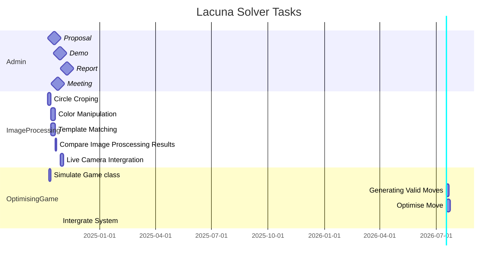

# Lacuna solver
> Solving the board game [Lacuna](https://boardgamegeek.com/boardgame/386937/lacuna) using computer vision (CV) and game theory.
This project compares three CV approaches of template matching, colour manipulation and machine learning

## Resources
[publisher rules and video](https://www.cmyk.games/products/lacuna)
[reddit strategy discussion from game designer](https://www.reddit.com/r/boardgames/comments/187cqiu/lacuna/)
[an hour of lacuna footage](https://www.youtube.com/watch?v=_wDohO9mW5E)

## Formats
A "token" is a flower (note that the user placments aren't included)  stored as a dictionary with the form **`{"pos": (x,y), "type": color}`**
- `pos` is the position, as an `(x,y)` tupple
- `color` is an `int` (0 thru 6) representing which color the token is (we don't need to represent them as a string, `int` is easier)

## Tasks

### Circle cropping
> Takes a full coloured image and crops it by the game boards circle

## Approach to the game:
```txt
Get initial image:
    Clasify the image
	    Method to extract the circle
	    perform CV on rest of image

Work out potential moves
Simulate the game with [a min-max algorithn (+ alpha beta pruning)](https://www.geeksforgeeks.org/minimax-algorithm-in-game-theory-set-4-alpha-beta-pruning/)

Return return best move

Get new image (move taken)
- work out what was taken (and record who it belongs to)
- calculate new potential moves as above
- calculate and return best 

When all moves are taken (ie each user has placed 6 tokens)
- Calculate the voranoi diagram
- and which remaining tokens are whos
```

## Structure:
### File plan
```txt
.
├── images/
│   ├── templates/
│   │   └── # all template images
│   └── initalGame/
│       └── # all images of the board (no turns)
├── out/
│   ├── progress/
│   │   ├── README.md
│   │   └── # update images, graphs, plots ect
│   └── logs/
│       └── # all log files
├── src/
│   ├── board.py # Classes ect to make the board and do graph board manupulation
│   ├── imageProsessingSuit # Input: image,  output: Board (uses the )
│   ├── colorManipulation # identifies board state with colour
│   └── templateMatching # identifies board state with images of board tokens
└── README.md
```

